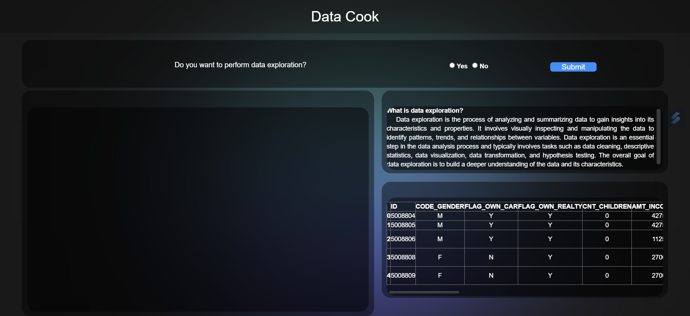

# Py-Maggie

# Data Preprocessing Web Application

## Overview

- **Project Description:** This repository hosts a zero-code web application designed for comprehensive data preprocessing and cleaning. It offers an interactive interface tailored for users with minimal coding experience.

- **Motivation:** While existing zero-code platforms, such as Azure Machine Learning, provide basic data preprocessing capabilities, there's a gap in tools that can perform advanced statistical analyses to produce refined datasets suitable for training machine learning models.

- **Implementation:** The application features a user-friendly front-end built with HTML, CSS, and JavaScript for an appealing and intuitive user experience. Its back-end is powered by Flask, a robust framework, to execute data preprocessing tasks based on user inputs. To enhance usability, detailed descriptions and recommendations guide users through each step, even if they have limited technical expertise.

**Please note:** This project is currently in the development phase, and further enhancements to the interface are planned.

## Interface Screenshot

## Key Features

- **Interactive Interface:** Easily upload datasets and perform diverse data preprocessing tasks via an intuitive web interface.

- **Data Transformation:** Access a comprehensive range of data preprocessing operations, including data cleaning, feature engineering, and advanced statistical analyses.

- **Guided Process:** Step-by-step instructions, along with insightful recommendations, assist users in navigating the data preprocessing journey effectively.

## Getting Started

To set up and run the web application locally, follow these steps:

1. Clone this repository: `git clone https://github.com/hareeharan03/Py-Maggie.git`
2. Navigate to the project directory: `cd py-maggie`
3. Install the required dependencies: `pip install -r requirements.txt`
4. Run the Flask application: `python app.py`
5. Access the web app in your browser at `http://localhost:5000`

## Usage

1. Upload your dataset to the web application.
2. Follow the detailed instructions to preprocess your data efficiently.
3. Review the recommended actions and descriptions to gain a deeper understanding of the process.
4. Download the preprocessed dataset for further analysis or machine learning model training.

## Contribution Guidelines

We welcome contributions from the community to enhance this project. To contribute, please adhere to these guidelines:

- Fork the repository.
- Create a new branch for your feature or bug fix.
- Commit your changes and push them to your fork.
- Open a pull request, clearly explaining your changes and why they should be merged.

## License

This project is licensed under the [MIT License](LICENSE).

## Contact Information

If you have any inquiries or require assistance, please don't hesitate to contact us at pymaggie.developer@gmail.com.

Happy data preprocessing!
